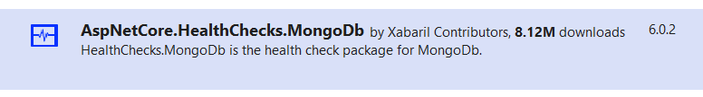

In any complex system, you have to deal with external dependencies.

More often than not, if one of the external systems (a database, another API, or an authentication provider) is down, the whole system might be affected.

In this article, we're going to learn what _Health Checks_ are, how to create custom ones, and how to check whether a MongoDB instance can be reached or not.

## What are Health Checks?

A Health Check is a special type of HTTP endpoint that allows you to understand the status of the system - well, it's a check on the health of the whole system, including external dependencies.

You can use it to understand whether the application itself and all of its dependencies are healthy and responding in a reasonable amount of time.

Those endpoints are also useful for humans, but are **even more useful for tools that monitor the application and can automatically fix** some issues if occurring - for example, they can restart the application if it's in a degraded status.

## How to add Health Checks in dotNET

Lucky for us, .NET already comes with Health Check capabilities, so we can just follow the existing standard without reinventing the wheel.

For the sake of this article, I created a simple .NET API application.

Head to the `Program` class - or, in general, wherever you configure the application - and add this line:

```cs
builder.Services.AddHealthChecks();
```

and then, after `var app = builder.Build();`, you must add the following line to have the health checks displayed under the _/healtz_ path.

```cs
app.MapHealthChecks("/healthz");
```

To sum up, the minimal structure should be:

```cs
var builder = WebApplication.CreateBuilder(args);

builder.Services.AddControllers();

builder.Services.AddHealthChecks();

var app = builder.Build();

app.MapHealthChecks("/healthz");

app.MapControllers();

app.Run();
```

So that, if you run the application and navigate to _/healthz_, you'll just see an almost empty page with two characteristics:

- the status code is _200_;
- the only printed result is _Healthy_

Clearly, that's not enough for us.

## How to create a custom Health Check class in .NET

Every project has its own dependencies and requirements. We should be able to build custom Health Checks and add them to our endpoint.

It's just a matter of creating a new class that implements `IHealthCheck`, an interface that lives under the `Microsoft.Extensions.Diagnostics.HealthChecks` namespace.

Then, you have to implement the method that tells us whether the system under test is healthy or degraded:

```cs
Task<HealthCheckResult> CheckHealthAsync(HealthCheckContext context, CancellationToken cancellationToken = default);
```

The method returns an `HealthCheckResult`, which is a struct that can have those values:

- **Healthy**: everything is OK;
- **Degraded**: the application is running, but it's taking too long to respond;
- **Unhealthy**: the application is offline, or an error occurred while performing the check.

So, for example, we build a custom Health Check class such as:

```cs
public class MyCustomHealthCheck : IHealthCheck
{
    private readonly IExternalDependency _dependency;

    public MyCustomHealthCheck(IExternalDependency dependency)
    {
        _dependency = dependency;
    }

    public Task<HealthCheckResult> CheckHealthAsync(
        HealthCheckContext context, CancellationToken cancellationToken = default)
    {
        var isHealthy = _dependency.IsHealthy();

        if (isHealthy)
        {
            return Task.FromResult(HealthCheckResult.Healthy());
        }
        return Task.FromResult(HealthCheckResult.Unhealthy());
    }
}
```

And, finally, add it to the Startup class:

```cs
builder.Services.AddHealthChecks()
    .AddCheck<MyCustomHealthCheck>("A custom name");
```

Now, you can create a stub class that implements `IExternalDependency` to toy with the different result types. In fact, if we create and inject a stub class like this:

```cs
public class StubExternalDependency : IExternalDependency
{
    public bool IsHealthy() => false;
}
```

and we run the application, we can see that the final result of the application is **Unhealthy**.

**A question for you**: why should we specify a name to health checks, such as "A custom name"? Drop a comment below 📩

## Adding a custom Health Check Provider for MongoDB

Now we can create a custom Health Check for MongoDB.

Of course, we will need to use a library to access Mongo: so simply install via NuGet the package _MongoDB.Driver_ - we've already used this library in a previous article.

Then, you can create a class like this:

```cs
public class MongoCustomHealthCheck : IHealthCheck
{
    private readonly IConfiguration _configurations;
    private readonly ILogger<MongoCustomHealthCheck> _logger;

    public MongoCustomHealthCheck(IConfiguration configurations, ILogger<MongoCustomHealthCheck> logger)
    {
        _configurations = configurations;
        _logger = logger;
    }

    public async Task<HealthCheckResult> CheckHealthAsync(
        HealthCheckContext context, CancellationToken cancellationToken = default)
    {
        try
        {
            await MongoCheck();
            return HealthCheckResult.Healthy();
        }
        catch (Exception ex)
        {
            return HealthCheckResult.Unhealthy();
        }
    }

    private async Task IsMongoHealthy()
    {
        string connectionString = _configurations.GetConnectionString("MongoDB");
        MongoUrl url = new MongoUrl(connectionString);

        IMongoDatabase dbInstance = new MongoClient(url)
            .GetDatabase(url.DatabaseName)
            .WithReadPreference(new ReadPreference(ReadPreferenceMode.Secondary));

        _ = await dbInstance.RunCommandAsync<BsonDocument>(new BsonDocument { { "ping", 1 } });
    }
}
```

As you can see, it's nothing more than a generic class with some services injected into the constructor.

The key part is the `IsMongoHealthy` method: it's here that we access the DB instance. Let's have a closer look at it.

### How to Ping a MongoDB instance

Here's again the `IsMongoHealthy` method.

```cs
string connectionString = _configurations.GetConnectionString("MongoDB");
MongoUrl url = new MongoUrl(connectionString);

IMongoDatabase dbInstance = new MongoClient(url)
    .GetDatabase(url.DatabaseName)
    .WithReadPreference(new ReadPreference(ReadPreferenceMode.Secondary));

_ = await dbInstance.RunCommandAsync<BsonDocument>(new BsonDocument { { "ping", 1 } });
```

Clearly, we create a reference to a specific DB instance: `new MongoClient(url).GetDatabase(url.DatabaseName)`. Notice that we're requiring access to the Secondary node, to avoid performing operations on the Primary node.

Then, we send the _PING_ command: `dbInstance.RunCommandAsync<BsonDocument>(new BsonDocument { { "ping", 1 } })`.

Now what? The _PING_ command either returns an object like this:

```json
{
  "ok": 1
}
```

or, if the command cannot be executed, it throws a `System.TimeoutException`.

## MongoDB Health Checks with AspNetCore.Diagnostics.HealthChecks

If we don't want to write such things on our own, we can rely on pre-existing libraries.

`AspNetCore.Diagnostics.HealthChecks` is a library you can find on GitHub that automatically handles several types of Health Checks for .NET applications.

Note that **this library is NOT maintained or supported by Microsoft** - but it's featured in the official .NET documentation.

This library exposes several NuGet packages for tens of different dependencies you might want to consider in your Health Checks. For example, we have _Azure.IoTHub_, _CosmosDb_, _Elasticsearch_, _Gremlin_, _SendGrid_, and many more.

Obviously, we're gonna use the one for MongoDB. It's quite easy.

First, you have to install the _AspNetCore.HealthChecks.MongoDb_ NuGet package.



Then, you have to just add a line of code to the initial setup:

```cs
builder.Services.AddHealthChecks()
    .AddMongoDb(mongodbConnectionString: builder.Configuration.GetConnectionString("MongoDB"))
```

That's it! Neat and easy! 😎

## Why do we even want a custom provider?

Ok, if we can just add a line of code instead of creating a brand-new class, why should we bother creating the whole custom class?

There are some reasons to create a custom provider:

1. You want more control over the DB access: for example, you want to ping only Secondary nodes, as we did before;
2. You don't just want to check if the DB is up, but also the performance of doing some specific operations, such as retrieving all the documents from a specified collection.

But, yes, in general, you can simply use the NuGet package we used in the previous section, and you're good to go.

## Further readings

As usual, the best way to learn more about a topic is by reading the official documentation:

🔗 [Health checks in ASP.NET Core | Microsoft Docs](https://learn.microsoft.com/en-us/aspnet/core/host-and-deploy/health-checks)

How can you use MongoDB locally? Well, easy: \*with Docker!

-

🔗 [First steps with Docker: download and run MongoDB locally | Code4IT](https://www.code4it.dev/blog/run-mongodb-on-docker)

As we saw, we can perform PING operation on a MongoDB instance.

🔗 [Ping command | MongoDB](https://www.mongodb.com/docs/manual/reference/command/ping/)

_This article first appeared on [Code4IT 🐧](https://www.code4it.dev/)_

Finally, here's the link to the GitHub repo with the list of Health Checks:

🔗 [AspNetCore.Diagnostics.HealthChecks | GitHub](https://github.com/Xabaril/AspNetCore.Diagnostics.HealthChecks)

and, if you want to sneak peek at the MongoDB implementation, you can read the code here:

🔗 [MongoDbHealthCheck.cs | GitHub](https://github.com/Xabaril/AspNetCore.Diagnostics.HealthChecks/blob/master/src/HealthChecks.MongoDb/MongoDbHealthCheck.cs)

## Wrapping up

In this article, we've learned two ways to implement Health Checks for a MongoDB connection.

You can either use a pre-existing NuGet package, or you can write a custom one on your own. It all depends on your use cases.

I hope you enjoyed this article! Let's keep in touch on [Twitter](https://twitter.com/BelloneDavide) or [LinkedIn](https://www.linkedin.com/in/BelloneDavide/), if you want! 🤜🤛

Happy coding!

🐧
