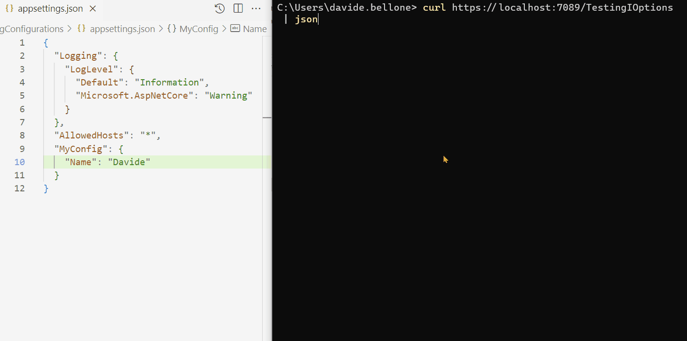
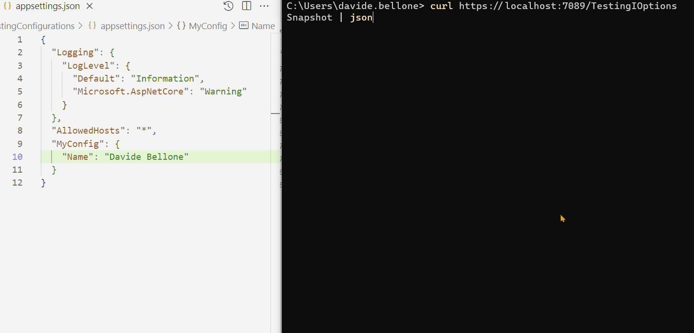
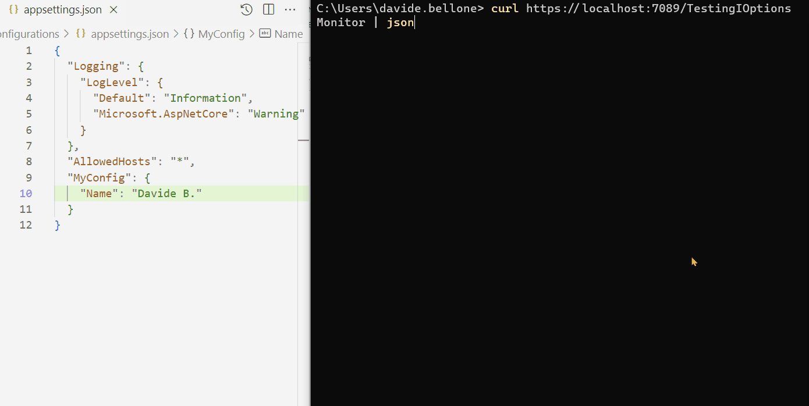

When dealing with configurations in a .NET application, we can choose different strategies. For example, you can simply inject an `IConfiguration` instance in your constructor, and retrieve every value by name.

Or you can get the best out of **Strongly Typed Configurations** - you won't have to care about casting those values manually because everything is already done for you by .NET.

In this article, we are going to learn about `IOptions`, `IOptionsSnapshot`, and `IOptionsMonitor`. They look similar, but there are some key differences that you need to understand to pick the right one.

For the sake of this article, I've created a dummy .NET API that exposes only one endpoint.

In my *appsettings.json* file, I added a node:

```json
{
    "MyConfig": {
        "Name": "Davide"
    }
}
```

that will be mapped to a POCO class:

```cs
public class GeneralConfig
{
    public string Name { get; set; }
}
```

To add it to the API project, we can add this line to the *Program.cs* file:

```cs
builder.Services.Configure<GeneralConfig>(builder.Configuration.GetSection("MyConfig"));
```

As you can see, it takes the content with the name "MyConfig" and maps it to an object of type `GeneralConfig`.

To test such types, I've created a set of dummy API Controllers. Each Controller exposes one single method, `Get()`, that reads the value from the configuration and returns it in an object.

We are going to inject `IOptions`, `IOptionsSnapshot`, and `IOptionsMonitor` into the constructor of the related Controllers so that we can try the different approaches.

## IOptions: Simple, Singleton, doesn't support config  reloads

`IOptions<T>` is the most simple way to inject such configurations. We can inject it into our constructors and access the actual value using the `Value` property:

```cs
private readonly GeneralConfig _config;

public TestingController(IOptions<GeneralConfig> config)
{
    _config = config.Value;
}
```

Now we have direct access to the `GeneralConfig` object, with the values populated as we defined in the *appsettings.json* file.

There are a few things to consider when using `IOptions<T>`:

* This service is injected as a **Singleton instance**: the whole application uses the same instance, and it is valid throughout the whole application lifetime.
* **all the configurations are read at startup time**. Even if you update the *appsettings* file while the application is running, you won't see the values updated.

Some people prefer to store the `IOptions<T>` instance as a private field, and access the value when needed using the `Value` property, like this:

```cs
private readonly IOptions<GeneralConfig> _config;
private int updates = 0;

public TestingController(IOptions<GeneralConfig> config)
{
    _config = config;
}

[HttpGet]
public ActionResult<Result> Get()
{
    var name = _config.Value.Name;
    return new Result
    {
        MyName = name,
        Updates = updates
    };
}
```

**It works, but it's useless**: since `IOptions<T>` is a Singleton, we don't need to access the `Value` property every time. It won't change over time, and accessing it every single time is a useless operation. We can use the former approach: it's easier to write and (just a bit) more performant.

One more thing.
When writing **Unit Tests**, we can inject an `IOptions<T>` in the system under test using a static method, `Options.Create<T>`, and pass it an instance of the required type.

```cs
[SetUp]
public void Setup()
{
    var config = new GeneralConfig { Name = "Test" };

    var options = Options.Create(config);
    
    _sut = new TestingController(options);
}
```

### Demo: the configuration does not change at runtime

Below you can find a GIF that shows that the configurations do not change when the application is running.



As you can see, I performed the following steps:

1. start the application
2. call the */TestingIOptions* endpoint: it returns the name Davide
3. now I update the content of the *appsettings.json* file, setting the name to Davide Bellone.
4. when I call again the same endpoint, I don't see the updated value.


## IOptionsSnapshot: Scoped, less-performant, supports config reload

Similar to `IOptions<T>` we have `IOptionsSnapshot<T>`. They work similarly, but there is a huge difference: **`IOptionsSnapshot<T>` is recomputed at every request.**

```cs
public TestingController(IOptionsSnapshot<GeneralConfig> config)
{
    _config = config.Value;
}
```

With `IOptionsSnapshot<T>` you have always the most updated values: **this service is injected with a Scoped lifetime**, meaning that the values are read from configuration at every HTTP request. This also means that **you can update the settings values while the application is running**, and you'll be able to see the updated results.

Since .NET rebuilds the configurations at every HTTP call, **there is a slight performance overhead**. So, if not necessary, always use `IOptions<T>`.

There is no way to test an `IOptionsSnapshot<T>` as we did with `IOptions<T>`, so you have to use stubs or mocks (maybe with [Moq or NSubstitute 🔗](https://code4it.dev/blog/moq-vs-nsubstitute-syntax/)).

### Demo: the configuration changes while the application is running

Look at the GIF below: here I run the application and call the */TestingIOptionsSnapshot* endpoint.



I performed the following steps:

1. run the application
2. call the */TestingIOptionsSnapshot* endpoint. The returned value is the same on the *appsettings.json* file: Davide Bellone.
3. I then update the value on the configuration file
4. when calling again */TestingIOptionsSnapshot*, I can see that the returned value reflects the new value in the _appsettings_ file.

## IOptionsMonitor: Complex, Singleton, supports config reload

Finally, the last one of the trio: `IOptionsMonitor<T>`. 

Using `IOptionsMonitor<T>` you can have the most updated value on the appsettings.json file.

We also have a callback event that is triggered every time the configuration file is updated.

It's injected as a Singleton service, so the same instance is shared across the whole application lifetime.

There are two main differences with `IOptions<T>`:

1. the name of the property that stores the config value is `CurrentValue` instead of `Value`;
2. there is a callback that is called every time you update the settings file: `OnChange(Action<TOptions, string?> listener)`. You can use it to perform operations that must be triggered every time the configuration changes.

Note: **`OnChange` returns an object that implements `IDisposable` that you need to dispose**. Otherwise, as [Chris Elbert noticed (ps: follow him on Twitter!) ](https://twitter.com/realchrisebert/status/1403304311510208526), the instance of the class that uses `IOptionsMonitor<T>` will never be disposed.

 

Again, there is no way to test an `IOptionsMonitor<T>` as we did with `IOptions<T>`. So you should rely on stubs and mocks (again, maybe with [Moq or NSubstitute 🔗](https://code4it.dev/blog/moq-vs-nsubstitute-syntax/)).

### Demo: the configuration changes, and the callback is called

In the GIF below I demonstrate the usage of `IOptionsMonitor`.

I created an API controller that listens to changes in the configuration, updates a static counter, and returns the final result from the API:

```cs
public class TestingIOptionsMonitorController : ControllerBase
{
    private static int updates = 0;
    private readonly GeneralConfig _config;

    public TestingIOptionsMonitorController(IOptionsMonitor<GeneralConfig> config)
    {
        _config = config.CurrentValue;
        config.OnChange((_, _) => updates++);
    }

    [HttpGet]
    public ActionResult<Result> Get() => new Result
    {
        MyName = _config.Name,
        Updates = updates
    };
}
```

By running it and modifying the config content while the application is up and running, you can see the full usage of `IOptionsMonitor<T>`:



As you can see, I performed these steps:

1. run the application
2. call the */TestionIOptionsMonitor* endpoint. The MyName field is read from config, and Updates is 0;
3. I then update and save the config file. In the background, the `OnChange` callback is fired, and the Updates value is updated;

Oddly, the callback is called more times than expected. I updated the file only twice, but the counter is set to 6. That's weird behavior. If you know why it happens, drop a message below 📩

## IOptions vs IOptionsSnapshot vs IOptionsMonitor in .NET

We've seen a short introduction to `IOptions`, `IOptionsSnapshot`, and `IOptionsMonitor`.

There are some differences, of course. Here's a table with a recap of what we learned from this article.

| Type | DI Lifetime | Best way to inject in unit tests |Allows live reload |  Has callback function | 
|-----|----|---|---|---|
|`IOptions<T>` | Singleton | `Options.Create<T>`| ❌ |  ❌ |
|`IOptionsSnapshot<T>` | Scoped | Stub / Mock | 🟢 | ❌ |
|`IOptionsMonitor<T>` | Singleton | Stub / Mock  | 🟢  | 🟢  |

There's actually more: for example, with `IOptionsSnapshot` and `IOptionsMonitor` you can use **named options**, so that you can inject more instances of the same type that refer to different nodes in the JSON file.

But that will be the topic for a future article, so stay tuned 😎

## Further readings

There is a lot more about how to inject configurations.

For sure, one of the best resources is the official documentation:

🔗 [Options pattern in ASP.NET Core | Microsoft docs](https://learn.microsoft.com/en-us/aspnet/core/fundamentals/configuration/options)

I insisted on explaining that `IOptions` and `IOptionsMonitor` are *Singleton*, while `IOptionsSnapshot` is *Scoped*.
If you don't know what they mean, here's a short but thorough explanation:

🔗 [Dependency Injection lifetimes in .NET | Code4IT](https://code4it.dev/blog/dependency-injection-lifetimes/)

In particular, I want you to focus on the Bonus tip, where I explain the problems of having *Transient* or *Scoped* services injected into a *Singleton* service:

🔗[Bonus tip: Transient dependency inside a Singleton | Code4IT](https://code4it.dev/blog/dependency-injection-lifetimes/#bonus-tip-transient-dependency-inside-a-singleton)

_This article first appeared on [Code4IT 🐧](https://www.code4it.dev/)_

In this article, I stored my configurations in an appsettings.json file. There are more ways to set configuration values - for example, Environment Variables and launchSettings.json.

🔗 [3 (and more) ways to set configuration values in .NET | Code4IT](https://code4it.dev/blog/how-to-set-configurations-values-dotnet/)

## Wrapping up

In this article, we learned how to use `IOptions<T>`, `IOptionsSnapshot<T>`, and `IOptionsMonitor<T>` in a .NET 7 application.

There are many other ways to handle configurations: for instance, you can simply inject the whole object as a singleton, or use `IConfiguration` to get single values.

When would you choose an approach instead of another? Drop a comment below! 📩

I hope you enjoyed this article! Let's keep in touch on [Twitter](https://twitter.com/BelloneDavide) or [LinkedIn](https://www.linkedin.com/in/BelloneDavide/)! 🤜🤛

Happy coding!

🐧
