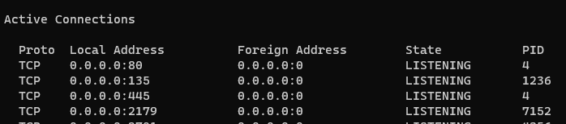
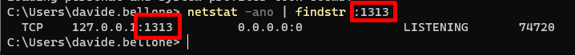
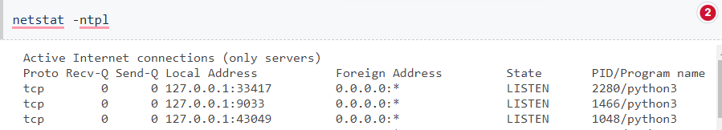

If you have the port _1313_ used by a process, and you want to kill that process to free up that port, you can follow these steps.

Depending on the machine and the shell, there are different ways.

## PowerShell or Cmd on Windows

Using **PowerShell on Windows**, use the `netstat` command to get the network info, and filter the result via `findstr`:

```cmd
netstat -ano | findstr :1313
```

`netstat` accepts different flags:

- `-a`: Displays all connections and listening ports;
- `-n`: Displays addresses and port numbers in numerical form.
- `-o`: Displays the owning process ID associated with each connection.

It returns all the network info:



Then you can filter the result with `findstr` by specifying the text to be searched:



Now, locate the Process ID (PID). In this case, it's _74720_.

## Linux shell

Similarly, `netstat` works on Linux. But with **different flags**.

- `-l`: display listening server sockets;
- `-t`: filter by connection of type TCP;
- `-p`: display PID/Program name for sockets;
- `-n`: don't resolve names (Show IP instead of Host Name);

So, run:

```cmd
netstat -ltnp
```



And, to filter the result, use the `grep` command:

```cmd
netstat -ltnp | grep :1313
```

And then locate the port.

## External references

🔗 [How to Kill a Process Running on a Port](https://dev.to/smpnjn/how-to-kill-a-process-running-on-a-port-3pdf)
