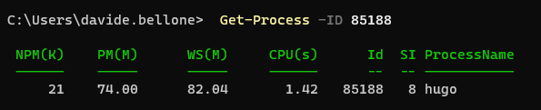

To retrieve the info about a process given its PID, for example, _85188_, you can use the **PowerShell** command `Get-Process`:

```cmd
Get-Process -ID 85188
```

That will return some info, such as the name of the process:



And then, to kill it, you can run

```cmd
taskkill /PID 85188 /F
```

## Related notes

🔗 [How to find the process that is bound to a Port?](https://notes.code4it.dev/how-to-find-the-process-bound-to-a-port/)

## External references

🔗 [How to Kill a Process Running on a Port](https://dev.to/smpnjn/how-to-kill-a-process-running-on-a-port-3pdf)
