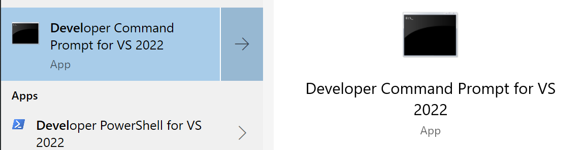
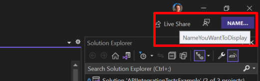

To run Visual Studio without all the configurations, themes, and references to user settings, you need to run an instance in a **sandbox**.

On Windows, open a Powershell or the VS2022 Developer Console:



and type

```plaintext
devenv /RootSuffix NameYouWantToDisplay
```

_NameYouWantToDisplay_ is the name that will appear on the top-right corner.



Then, you can change the theme by navigating Tools>Options>Environment>General.

More info at [Use Visual Studio in Presentation Mode 🔗](https://devblogs.microsoft.com/visualstudio/use-visual-studio-in-presentation-mode)
