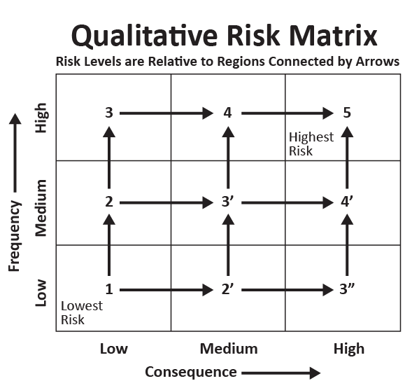

Every project has its share of risks that can impact its success or its failure.

Knowing what they are and how we can handle them is one of the roles of a good software architect.

What kind of risks do we have to deal with?

## Types of risks

### Functional risk

It raises when the **requirements are not correct or not clear**, and it is usually caused by the lack of communication between stakeholders (business analysts, management, end-users).

### Management risk

It occurs when **managers don't have enough experience** with the skills required by the project.

Or, more simply, when the organization structure is not clear and the communication is impacted.

### Legal risks

Are there any laws, regulations, legal stuff that may impact the success of the project?

Think of **privacy concerns**, quality certifications, access to certain countries.

### Technical risk

Is the project too complex?

Or, maybe, you **depend on external tools** (like licensed APIs), and you need some workaround to integrate that tool with your project.

Or you just need to use a new language/framework required for your project

### Personnel risk

It may happen that your **team** is under-staffed, or that the team members do not have the experience and skills required to work on that project

### Financial risk

Do you have enough **budget** for the project?

Is the **Return Of Investments (ROI)** worth the money you spend on building the project?

## How to handle risks

You must address all those risks - in one way or another.

How?

Understand:

- what's the probability that the risk will occur?
- what's the impact on the project?

Answer those questions, and begin by addressing the most critical issues.

Ok, but what can we do about it?
We have 4 strategies:

### Accept it

Some risks can be simply accepted: it's a bet on the success of the project.

I.E. you can decide to publish your project earlier to be more competitive on the market - but sacrificing project quality.

### Mitigate it

Reduce the probability it will occur.

Is your team under-staffed? Hire new people.

Is your team lacking some skills? Find a crash course to fill their gaps and bring them back on track.

### Transfer it to another party

Say that you work with some contractors that will build part of your product.

You can add a penalty to the contract that will be incurred if they are late and cause to project to be postponed

### Avoid it

Sometimes you can just avoid the risk: say that there's the risk of incurring some legal issues when publishing your application to a specific country.

You can _accept_ the risk, and publish it anyway, or _avoid_ the risk by not publishing it to that country.

## Wrapping up

We've seen that there are different kinds of risks that managers must deal with, and one of the roles of Software Architects is to support management in this analysis.

You can handle risk in several ways, but you must remember one key part: every choice has its consequences and drawbacks.

So, consider carefully how to handle every possible risk: even avoiding one can bring other new risks to the table.
